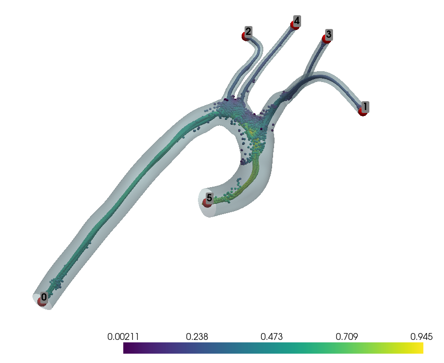
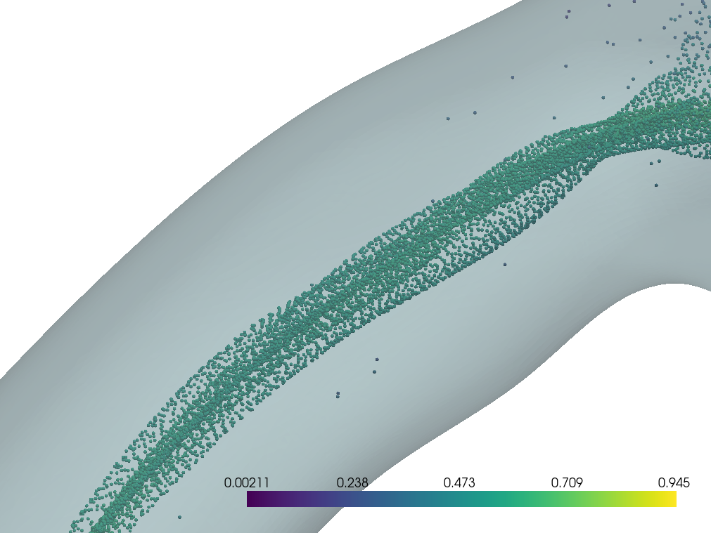
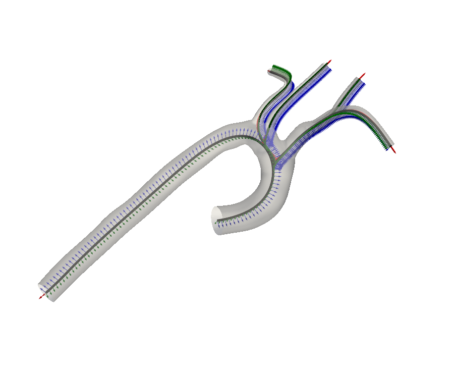
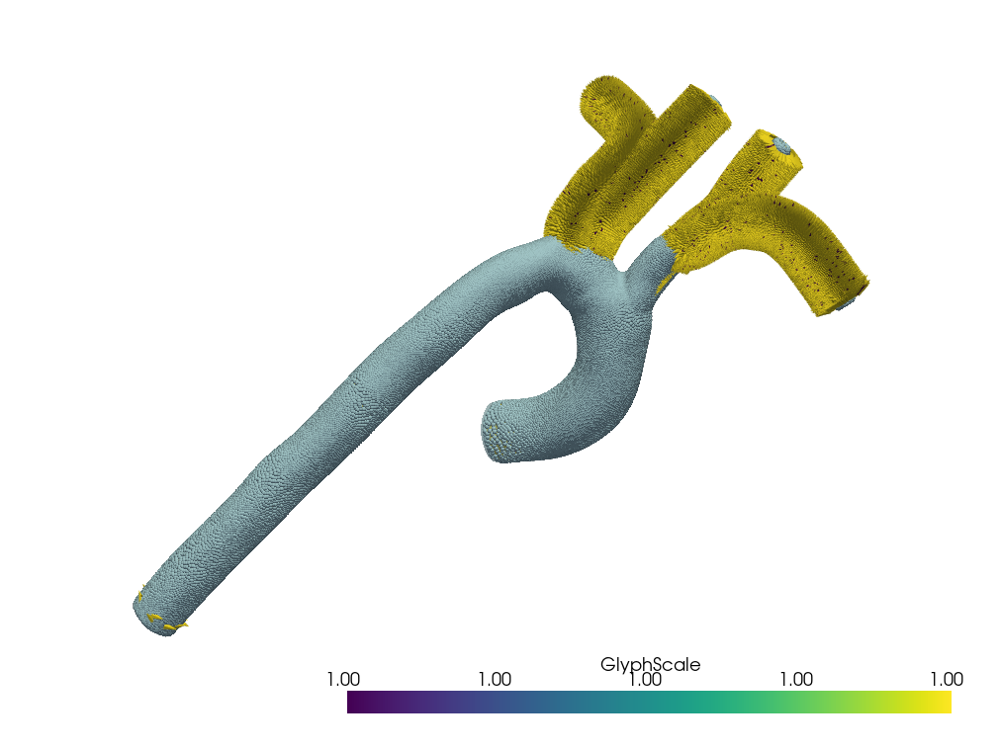

# tutorial - vascular_encoding_framework


## Introducción

La implementación de Vascular Encoding Framework para analizar y comparar estructuras vasculares.


## Tabla de Contenidos

- [Requisitos](#requisitos)
- [Instalación](#instalación)
- [Uso](#uso)
  - [Importación de Librerías](#importación-de-librerías)
  - [Configuración del Caso de Estudio](#configuración-del-caso-de-estudio)
  - [Carga y Preparación de la Malla](#carga-y-preparación-de-la-malla)
  - [Inicialización de VascularMesh](#inicialización-de-vascularmesh)
  - [Visualización y Definición de la Jerarquía de Límites](#visualización-y-definición-de-la-jerarquía-de-límites)
  - [Extracción del Dominio de la Línea Central](#extracción-del-dominio-de-la-línea-central)
  - [Cálculo del Árbol de Caminos de la Línea Central](#cálculo-del-árbol-de-caminos-de-la-línea-central)
  - [Definición de los Nudos para Cada Rama](#definición-de-los-nudos-para-cada-rama)
  - [Creación de la Red de Líneas Centrales](#creación-de-la-red-de-líneas-centrales)
  - [Visualización del Marco Adaptado](#visualización-del-marco-adaptado)
  - [Cálculo de las Coordenadas del Vaso](#cálculo-de-las-coordenadas-del-vaso)
  - [Visualización de los Resultados](#visualización-de-los-resultados)
- [Outputs](#outputs)
- [Figuras](#figuras)
   - [Figuras principales](#figuras-principales)
   - [Figuras secundarias](#figuras-secundarias)
- [Troubleshooting](#troubleshooting)
- [Contribuciones](#contribuciones)
- [Licencia](#licencia)


## Requisitos

- Python 3.x
- Conda (recomendado para la gestión de entornos)

## Instalación

1. Clona el repositorio:

```bash
git clone https://github.com/PauR0/vascular_encoding_framework.git
```

2. Crea un entorno virtual e instala las dependencias:

```bash
conda create -n vef_env python=3.8
conda activate vef_env
```

## Uso

### Importación de Librerías

```python
import os
import numpy as np
import pyvista as pv
import vascular_encoding_framework as vef
from vascular_encoding_framework.jose.casepath import CasePath
```
Estas líneas importan las bibliotecas necesarias para el tutorial, incluyendo el framework de codificación vascular (VEF). Estas dependencias son descargadas al crear el entorno virtual mediante requierements.txt.

### Configuración del Caso de Estudio

```python
case_path_obj = CasePath()
case_path = case_path_obj.get_case_path()
mesh_path = os.path.join(case_path, 'Meshes', '0093_0001.vtp')
```

Aquí se define la ruta al caso de estudio descargado del Vascular Model Repository.

### Carga y Preparación de la Malla

```python
mesh = pv.read(mesh_path)
mesh = mesh.threshold(value=0.1, scalars='CapID', method='lower').extract_surface()
mesh = mesh.smooth(n_iter=100)
mesh = mesh.subdivide(1)  # Aumenta el nivel de subdivisión si es necesario
```
Se carga la malla y se abre eliminando las tapas (caps) para obtener una malla abierta.

### Inicialización de VascularMesh

```python
vmesh = vef.VascularMesh(mesh)
```

Se inicializa la clase VascularMesh con la malla abierta.

### Visualización y Definición de la Jerarquía de Límites

```python
vmesh.plot_boundary_ids()
```

Este comando muestra visualmente los identificadores (IDs) asignados a cada límite de la malla vascular. Esto es útil para entender cómo están numerados o etiquetados los diferentes segmentos o regiones de la estructura vascular.


```python 
hierarchy = {
    "5" : {"id" : "5", "parent" : None, "children" : {"0"},},
    "0" : {"id" : "0", "parent" : "5",  "children" : {"3", "4", "1"}},
    "3" : {"id" : "3", "parent" : "0",  "children" : {"2"}},
    "4" : {"id" : "4", "parent" : "0",  "children" : {}},
    "1" : {"id" : "1", "parent" : "0",  "children" : {}},
    "2" : {"id" : "2", "parent" : "3",  "children" : {}},
}
```


Esta estructura de diccionario define la jerarquía de los límites. Cada entrada representa un límite y especifica:

- Su ID.
- Su padre (parent) en la jerarquía.
- Sus hijos (children) en la jerarquía.

Esta jerarquía es crucial para entender la estructura topológica del vaso sanguíneo, relacionando las entradas y salidas del flujo sanguíneo.

- El límite `5` es la raíz de la jerarquía (no tiene padre).
- El límite `0` es hijo de `5` y padre de `3`, `4` y `1`.
- Los límites `1`, `2`, `4` son hojas (no tienen hijos).

```python
vmesh.set_boundary_data(hierarchy)
```

Este comando aplica la jerarquía definida a la malla vascular. 


### Extracción del Dominio de la Línea Central


```python
c_domain = vef.centerline.extract_centerline_domain(vmesh=vmesh,
                                                    method='seekers',
                                                    method_params={'reduction_rate':0.75, 
                                                    'eps': 1e-3},
                                                    debug=False)   
```

Este código emplea la función `centerline.extract_centerline_domain` de VEF y se utiliza para obtener una aproximación del dominio del lumen del vaso sanguíneo. Mediante este comando, obtendremos una nube de puntos que luego usaremos como dominio para obtener el camino óptimo entre ellos. La línea central es una representación simplificada del eje central de los vasos sanguíneos.

#### Parámetros utilizados:

- **vmesh**: Es la malla vascular inicializada previamente.

- **method = 'seekers'**: Este método a usar será el algoritmo *seekers*, usado para buscar y extraer el dominio de la línea central. 


- **method_params**: Son parámetros específicos para ajustar el método *seekers*:
  - **reduction_rate=0.75**: Esto sugiere que el algoritmo reduce la complejidad del dominio en un 75%, para optimizar el cálculo. Controla la tasa de reducción de la malla original, afectando cuántos puntos se mantienen para calcular la línea central.
  
  - **eps = 1e-3**: Valor usado como un umbral de tolerancia para el algoritmo elegido.

- **debug = False**: 
  - Cuando está en False, no se muestran visualizaciones del proceso de extracción.
  - Cuando está en True, proporciona una serie de gráficas, que veremos en el apartado [Figuras secundarias](#figuras-secundarias).

#### Algoritmo *seekers*:

- La clase Seekers utiliza un enfoque basado en *buscadores* para extraer el dominio de la línea central.
- Inicialmente, se crea una versión simplificada de la malla original mediante decimación y suavizado (método `compute_seekers_initial_positions`). Esto nosotros no lo aplicamos porque no nos interesa decimar la malla por la baja resolución intrínseca de la malla descargada del tutorial, pero lo podemos redefinir mediante el parámetro `reduction_rate`.

- Luego, para cada punto "buscador":
  1. Se calcula la normal interna de la superficie.
  2. Se traza un rayo desde el punto en la dirección de la normal interna.
  3. Se encuentra el punto de intersección de este rayo con la pared opuesta del vaso.
  4. El punto medio entre el punto inicial y el punto de intersección se considera parte del dominio de la línea central.

Este proceso se repite para múltiples puntos en la superficie, creando la nube de puntos.


Una vez obtenemos la nube de puntos a lo largo de todo el interior del vaso sanguíneo, procedemos con el cálculo del árbol de caminos, que representará la línea central.


### Cálculo del árbol de caminos de la línea central

```python
cp_xtractor = vef.centerline.CenterlinePathExtractor()
cp_xtractor.debug = True
cp_xtractor.set_centerline_domain(c_domain)
cp_xtractor.set_vascular_mesh(vmesh, update_boundaries=True)
cp_xtractor.compute_paths() 
```

Este código calcula el árbol de caminos de la línea central según la jerarquía definida.


1. **Inicialización del extractor de caminos:**
   ```python
   cp_xtractor = vef.centerline.CenterlinePathExtractor()
   ```
   Crea una instancia de la clase `CenterlinePathExtractor`, diseñada para extraer y computar los caminos de la línea central en una malla vascular.

2. **Activación del modo de depuración:**
   ```python
   cp_xtractor.debug = True
   ```
   Activa el modo de depuración del extractor. Cuando está activado, se genera una visualización 3D de la malla vascular, el dominio de la línea central y las etiquetas de los límites. Esto es útil para verificar visualmente la correcta configuración del problema antes de la extracción de la línea central.

3. **Configuración del dominio de la línea central:**
   ```python
   cp_xtractor.set_centerline_domain(c_domain)
   ```
   Establece el dominio de la línea central previamente extraído (`c_domain`) como base para el cálculo de los caminos. Como comentamos anteriormente, este dominio representa una aproximación del lumen del vaso.

4. **Configuración de la malla vascular:**
   ```python
   cp_xtractor.set_vascular_mesh(vmesh, update_boundaries=True)
   ```
   - Para cada punto de la línea central, se calcula la distancia al punto más cercano de la pared del vaso utilizando un K-Dimensional Tree
   - Estas distancias forman el campo de radios, que representa el grosor del vaso en cada punto de la línea central, esto permite generar una aproximación muy precisa de la geometría original del vaso sanguíneo. Según la Figura 4 del artículo, la aproximación mediante B-Splines usando el campo de radios reproduce muy de cerca los datos de entrada, con residuos generalmente bajos (alrededor de 1 mm en las zonas más complejas).

   - Mediante esta nueva geometría de la malla, actualiza los límites de la malla de partida con `update_boundaries=True`, por lo que trabajamos a partir de ahora sobre la nueva geometría.

   **Ventajas de esta representación:** 
    - La geometría se codifica con un número reducido de valores reales, lo que resulta en una representación de dimensión fija y baja, y, por tanto, reduce la complejidad computacional.
    
   - La aproximación resultante es una superficie diferenciable, lo que es útil para cálculos posteriores.

    - Al usar un sistema de coordenadas común (VCS), permite establecer correspondencias punto a punto entre diferentes anatomías.

    - Permite generar mallas específicas (como rejillas cilíndricas) necesarias para simulaciones de fluidos precisas.
    
    - Facilita el análisis de variabilidad de forma y la creación de modelos estadísticos de forma.

5. **Cálculo de los caminos:**
   ```python
   cp_xtractor.compute_paths()
   ```
   - Este método calcula los caminos desde cada salida (outlet) hasta la entrada (inlet) del vaso sanguíneo, utilizando la estructura jerárquica de límites previamente definida.

   - Utiliza una versión modificada del algoritmo A*, que en este caso se comporta como el algoritmo de Dijkstra debido a que la heurística está establecida en 0. Esto significa que el algoritmo busca el camino de menor costo entre los puntos.
    
   La línea central se define como:
   > "En nuestro trabajo, construimos la línea central como la curva **c** que conecta los dos planos A y B y que maximiza la distancia mínima desde la pared del vaso a cada punto de **c**"

El resultado es una estructura MultiBlock de pyvista con los caminos calculados, representando la línea central del vaso sanguíneo.


### Definición de los Nudos para Cada Rama

```python
knot_params = {
    "5" : {"cl_knots" : None, "tau_knots" : None, "theta_knots" : None},
    "0" : {"cl_knots" : 15,   "tau_knots" : 19,   "theta_knots" : 19},
    "3" : {"cl_knots" : 15,   "tau_knots" : 10,   "theta_knots" : 10},
    "4" : {"cl_knots" : 15,   "tau_knots" : 10,   "theta_knots" : 10},
    "1" : {"cl_knots" : 15,   "tau_knots" : 10,   "theta_knots" : 10},
    "2" : {"cl_knots" : 15,   "tau_knots" : 10,   "theta_knots" : 10},
}  
```


Se definen los grados de libertad para el procedimiento de ajuste de cada rama.

-----

1. **Estructura de knot_params**

   Cada entrada en knot_params corresponde a una rama del vaso sanguíneo, identificada por un número. Para cada rama, se definen tres tipos de nudos:
   
   * `cl_knots`
     Nudos para la línea central (centerline)
   * `tau_knots`
     Nudos para la coordenada longitudinal $\tau$
   * `theta_knots`
     Nudos para la coordenada longitudinal $\theta$

   Estos nudos son fundamentales para la representación del vaso sanguíneo utilizando B-Splines:
   
   * **Línea central (cl_knots)**
     * Se utiliza para aproximar la curva $c(\tau)$ que define la dirección longitudinal del vaso.
     * La ecuación 6 del artículo muestra cómo se representa la línea central:
       $$
       c(\tau) = \sum_{i=0}^{n} c_i B_{t,i}(\tau) \notag
       $$
       siendo $\mathbf{c}_{i}$ coeficientes tridimensionales y $B_{\mathbf{t}, i}$ una base del espacio de los B-Splines.
     * Los cl_knots determinan cuántos coeficientes $c_i$ se utilizarán en esta aproximación.
   
   * **Coordenadas de la pared (tau_knots y theta_knots)**
     * Se utilizan para aproximar la función $\rho_w(\tau,\theta)$ que describe la distancia de la pared al eje central.
     * La ecuación 7 del artículo muestra esta aproximación:
       $$
       \rho_w(\tau,\theta) = \sum_{i=0}^{n1} \sum_{j=0}^{n2} b_{ij} B_{ij}(\tau,\theta) \notag
       $$
       donde $B_{i, j}(x, y)=B_{i}(x) \cdot B_{j}(y)$ y $(\tau, \theta) \in[0,1] \times[0,2 \pi]$.
     * tau_knots y theta_knots determinan cuántos coeficientes $b_{ij}$ se utilizarán en esta aproximación bivariate.


**Importancia de los nudos:**

* Controlan la flexibilidad y precisión de la representación del vaso.
* Los parámetros knots definen los grados de libertad para el ajuste de los splines. Según el artículo, la calidad de la aproximación depende del número de nudos utilizados. Más nudos permiten una representación más detallada pero aumentan la complejidad computacional.

**Variación entre ramas:**

* La rama "5" tiene todos los valores en None, porque es la raíz.
* La rama "0" tiene más nudos (19 para tau y theta), lo que sugiere que podría ser un segmento más complejo o importante (Supongo que por ser más larga que el resto).
* Las otras ramas tienen menos nudos (10 para tau y theta), lo que podría indicar segmentos más simples o menos críticos.

**Relación con el VCS**

* Estos nudos permiten crear una representación paramétrica del vaso que es fundamental para el VCS.

Se representa entonces mediante la ecuación:

$$
\mathbf{x}(\tau, \theta)=\sum_{i=0}^{n} \mathbf{c}_{i} B_{i}(\tau)+\left[\sum_{i=0}^{n_{1}} \sum_{j=0}^{n_{2}} b_{i j} B_{i j}(\tau, \theta)\right]\left(\mathbf{v}_{1} \cos (\theta)+\mathbf{v}_{2} \sin (\theta)\right) \notag
$$

* Permiten la conversión entre coordenadas cartesianas y las coordenadas del vaso ($\tau$, $\theta$, $\rho$) de manera precisa y eficiente.


### Creación de la Red de Líneas Centrales

```python
cl_net = vef.CenterlineNetwork.from_multiblock_paths(cp_xtractor.paths, 
knots={k:v['cl_knots'] for k, v in knot_params.items()})    
```

Se crea la red de líneas centrales a partir de los caminos extraídos.


1. ```python
   cp_xtractor.paths
   ```
   Contiene los caminos discretos extraídos que maximizan la distancia a las paredes del vaso, tal y como hemos obtenido antes.

2. **Definición de nudos (knots)**

   ```python
   knots={k:v['cl_knots'] for k, v in knot_params.items()}
   ```
   Esta es una comprensión de diccionario que crea un nuevo diccionario. Para cada par clave-valor en knot_params, toma la clave k y el valor correspondiente a 'cl_knots' de v. Esto define el número de nudos a utilizar para cada segmento de la línea central en el ajuste de splines.

3. **Conversión a curvas diferenciables:**

   ```python
   vef.CenterlineNetwork.from_multiblock_paths()
   ```

   * Itera sobre cada camino en el MultiBlock.
   * Para cada camino, crea un objeto Centerline utilizando los puntos del camino y los parámetros de nudos especificados.
   * Ajusta una spline cúbica a los puntos del camino, utilizando el número de nudos especificado para controlar la complejidad del ajuste.
   * Establece las relaciones padre-hijo entre los segmentos de la línea central basándose en la información de 'parent' en los datos de campo. Esto es fundamental para representar la estructura ramificada de los vasos sanguíneos, donde un vaso principal puede dividirse en vasos más pequeños.
   * Maneja las uniones entre segmentos. En las uniones entre segmentos realizando un injerto (grafting) si es necesario para suavizar las transiciones.

4. **Resultado:**

   El resultado cl_net es una instancia de CenterlineNetwork que representa la estructura jerárquica de las líneas centrales de los vasos sanguíneos, con cada segmento representado como una spline cúbica y las relaciones topológicas entre segmentos preservadas.


Se crea una estructura jerárquica de curvas spline cúbicas que representan las líneas centrales del vaso sanguíneo, utilizando los caminos discretos extraídos y los parámetros de nudos especificados para cada rama. Proporciona una base matemática continua y diferenciable del VCS.

### Visualización del Marco Adaptado

```python
plot_adapted_frame(cl_net, vmesh, scale=.5)
```

Se visualiza el marco adaptado para verificar que la línea central se ha calculado correctamente.


Esta línea muestra la red de líneas centrales a partir de los caminos extraídos. Utiliza los parámetros de nudos especificados para cada rama del vaso sanguíneo.

La visualización del marco adaptado permite verificar que:

* El vector tangente t es perpendicular a la línea central en cada punto.
* Los vectores $v_1$ y $v_2$ mantienen una orientación consistente a lo largo de la curva, sin rotaciones abruptas.
* El marco se adapta suavemente a la curvatura del vaso.


El artículo enfatiza la necesidad de un marco de referencia estable para definir las coordenadas angulares $\theta$. La visualización permite confirmar que el marco adaptado obtenido por transporte paralelo es más estable que otros métodos, como el marco de Frenet.

Esta visualización proporciona una validación visual del VCS, permitiendo verificar que el marco de referencia local se comporta como se describe teóricamente en el artículo, adaptándose a la geometría del vaso mientras mantiene la estabilidad necesaria para definir un sistema de coordenadas consistente.


### Cálculo de las Coordenadas del Vaso

```python
bid = [cl_net.get_centerline_association(p=vmesh.points[i], n=vmesh.get_array(name='Normals', 
preference='point')[i], method='scalars', thrs=60) for i in range(vmesh.n_points)]
vcs = np.array([cl_net.cartesian_to_vcs(p=vmesh.points[i], 
cl_id=bid[i]) for i in range(vmesh.n_points)])
vmesh['cl_association'] = bid
vmesh['tau'] = vcs[:,0]
vmesh['theta'] = vcs[:,1]
vmesh['rho'] = vcs[:,2]   
```


Se calculan las coordenadas del vaso (VCS) para cada punto de la malla.


1. **Asociación de puntos a la línea central:**

   ```python
   bid = [cl_net.get_centerline_association(p=vmesh.points[i], 
          n=vmesh.get_array(name='Normals', preference='point')[i], 
          method='scalars', thrs=60) for i in range(vmesh.n_points)]
   ```

   Esta línea asocia cada punto de la malla vascular a una rama específica de la línea central. Utiliza la posición del punto (p) y su normal (n) para determinar la asociación más apropiada.

2. **Conversión de coordenadas cartesianas a VCS:**

   ```python
   vcs = np.array([cl_net.cartesian_to_vcs(p=vmesh.points[i], 
                   cl_id=bid[i]) for i in range(vmesh.n_points)])
   ```

   Aquí se convierten las coordenadas cartesianas de cada punto de la malla a coordenadas cilíndricas del VCS.

3. **Asignación de coordenadas VCS a la malla:**

   ```python
   vmesh['cl_association'] = bid
   vmesh['tau'] = vcs[:,0]
   vmesh['theta'] = vcs[:,1]
   vmesh['rho'] = vcs[:,2]
   ```

   Se asignan las coordenadas VCS calculadas ($\tau, \theta, \rho$) a la malla vascular.


### Visualización de los Resultados

```python
vmesh.plot(scalars='cl_association')
vmesh.plot(scalars='tau')
vmesh.plot(scalars='theta')
vmesh.plot(scalars='rho')    
```

Se visualizan los resultados de la asociación de líneas centrales y las coordenadas del vaso calculadas.


1. **Visualización de la asociación de líneas centrales:**

   ```python
   vmesh.plot(scalars='cl_association')
   ```

   Esta línea visualiza la asociación de cada punto de la malla con una rama específica de la línea central. Permite verificar que la asignación de puntos a las diferentes ramas del vaso es correcta.

2. **Visualización de la coordenada longitudinal $\tau$:**

   ```python
   vmesh.plot(scalars='tau')
   ```

   Se muestra la distribución de la coordenada $\tau$ a lo largo del vaso. Según el artículo, $\tau \in [0,1]$ representa la posición longitudinal normalizada en el segmento del vaso.

3. **Visualización de la coordenada angular $\theta$:**

   ```python
   vmesh.plot(scalars='theta')
   ```

   Esta visualización muestra la distribución de la coordenada angular $\theta$. $\theta \in [0, 2\pi]$ representa la posición angular en el plano perpendicular a la línea central.

4. **Visualización de la coordenada radial $\rho$:**

   ```python
   vmesh.plot(scalars='rho')
   ```

   Se visualiza la distribución de la coordenada radial $\rho$. $\rho \in \mathbb{R^+}$, representa la distancia desde la línea central hasta el punto en cuestión.


## Outputs

**Paso 1: Ejecutar el Script**
Al ejecutar el Tutorial modificado, obtendremos una serie de *outputs* que ofrecen información relevante para entender cómo está ejecutándose el código.

**Paso 2: Introducir la Ruta del Modelo**
En primer lugar, lo primero que veremos por pantalla es la solicitud de ingreso de la ruta del archivo que recientemente habremos descargado desde Vascular Model Repository.

```bash
(clean_vascular_env_jose) jose-marin@jose-marin-ASUS-TUF-Gaming-F17-FX707VV-FX707VV:
~/Escritorio/vascular_encoding_framework$ 
/home/jose-marin/miniconda3/envs/clean_vascular_env_jose/bin/python 
/home/jose-marin/Escritorio/vascular_encoding_framework/tutorials/tutorial_final.py
Enter the path to the case directory (e.g., /home/user/cases/0007_H_AO_H):    
```

De esta manera, introducimos la carpeta con la ruta contenedora del modelo .vtp. En este caso:

```bash
/home/jose-marin/Escritorio/vascular_encoding_framework/tutorials/0010_H_AO_H/Meshes
```

**Paso 3: Añadir un Nuevo Modelo (Opcional)**
En el caso de que queramos añadir otro modelo, procederemos a eliminar el archivo `CasePath.txt` del directorio donde se ha creado. En este caso, el directorio:

```bash
/home/jose-marin/Escritorio/vascular_encoding_framework/tutorials/0010_H_AO_H
```

Y modificaremos `0093_0001.vtp` en el tutorial, por el fichero .vtp dentro del directorio del caso. Así,

```python
mesh_path = os.path.join(case_path, 'Meshes', 'nombre_del_nuevo_mesh.vtp')
```

A partir de aquí, procederá a darnos como *output* la jerarquía de partida para las ramificaciones:

```bash
Initial boundaries:
Boundary 0 connected to: {'4', '1', '3'}
Boundary 1 connected to: set()
Boundary 2 connected to: set()
Boundary 3 connected to: {'2'}
Boundary 4 connected to: set()
Boundary 5 connected to: {'0'}
```

Y procederá a extraer el dominio de la línea central con los parámetros ajustados, proporcionándonos múltiples gráficas, dependiendo de si `debug = False`, o `debug = True`. Y luego, una gráfica final donde apreciaremos la nube de puntos generada por el método *seekers*.

Tras esto, se computará el camino óptimo entre los puntos, dándonos información adicional sobre la cantidad de puntos que toma llegar de un límite a otro de la estructura vascular, entre otros:

```bash
Attempting to compute path from boundary 5 to 0
No valid path found from boundary 5 to 0
Attempting to compute path from boundary 0 to 4
Path found: 106 points
Attempting to compute path from boundary 0 to 1
Path found: 106 points
Attempting to compute path from boundary 0 to 3
Path found: 106 points
Attempting to compute path from boundary 3 to 2
Path found: 74 points
Number of centerline domain points: 73277
Centerline domain bounding box: (-5.316318511962891, 4.683925628662109, -3.2394332885742188, 
1.9721324443817139, -2.424973964691162, 17.93456268310547)
```

Para finalizar, proporcionará una gráfica donde se podrá visualizar la construcción del VCS.


## Figuras

### Figuras principales

#### Figura 1

*Figura 1: Detalle del plot generado al activar la depuración con `cp_xtractor.debug = True`.*


- El gradiente representa la magnitud del radio del vaso sanguíneo a lo largo de la línea central. 
- Los puntos rojos numerados del 0 al 5 representan los límites o fronteras de la estructura vascular. 
- Los puntos del interior del vaso son los generados mediante el algoritmo de extracción de línea central, utilizando el método de `$seekers$`.

#### Figura 2

*Figura 2: Plano detalle de la nube de puntos obtenida mediante `$seekers$`, mostrando cómo los puntos medios en las intersecciones de las ramificaciones tienen posiciones más erráticas debido a la geometría entre la pared de partida y la opuesta. Esta condición no afecta la obtención de caminos, dado que existen muchos otros puntos que el algoritmo considera prioritarios, gracias a la densidad de puntos alrededor de la línea central.*

#### Figura 3

*Figura 3: Plano detalle de la nube de puntos obtenida mediante `$seekers$`, donde se observa que los puntos medios en las partes centrales de las ramificaciones tienen posiciones más estables debido a la geometría entre la pared de partida y la opuesta, facilitando la posterior obtención de caminos en esas zonas.*


#### Figura 4

*Figura 4: Plot del VCS generado mediante los comandos del apartado 4.*

#### Figura 5

*Figura 5: Plano detalle del VCS, demostrando claramente la estabilidad del sistema de coordenadas.*

### Figuras secundarias

Esta sección presentará las figuras que aparecen generalmente en caso de modificar el comando Debug = False, por Debug = True, o cuando se solicita graficar por pantalla algún paso intermedio. Son útiles en situaciones donde se desconoce por qué está fallando el script o para ver cómo se desarrollan ciertos aspectos del código.

#### Figura 6 

*Figura 6: Visualización de los límites o fronteras de la estructura vascular, numerados del 0 al 5. Obtenido mediante el comando `vmesh.plot_boundary_ids()`*

#### Figura 7

*Figura 7: Visualización que sirve para identificar puntos clave dentro de la estructura vascular que servirán como base para análisis posteriores más refinados*

Las líneas verdes son las normales de la superficie. El algoritmo Seekers utiliza estas normales internas para aproximar la posición de la línea central.

Los triángulos de colores representan:
- **Azules (start)**: Puntos de inicio de los segmentos vasculares.
- **Rojos (stop)**: Puntos finales de los segmentos vasculares.
- **Rosas (intersection)**: Puntos de intersección entre diferentes segmentos.
- **Naranjas (midpoint)**: Puntos medios de los segmentos vasculares.

#### Figura 8

*Figura 8: Visualización de los vectores normales internos de la superficie normalizados*

Los vectores normales internos parten desde la superficie hacia dentro. Estos están normalizados. En la parte de la aorta ascendente y descendiente los vectores no autointersectan con la pared opuesta, ya que el radio del vaso en esa zona es mayor a 1, por lo que las flechas no son visibles. No obstante, en la zona de las arterias superiores, al tener un radio menor a 1, los vectores intersectan con la pared opuesta.

El GlyphScale indica la longitud de los vectores normales, que es 1. En el caso de que nos acercásemos a ver el interior de la aorta descendiente y ascendente, veríamos que efectivamente esos vectores también son amarillos, es decir, de longitud 1.

#### Figura 9

*Figura 9: Visualización tríptica de la malla tridimensional, los vectores normales internos normalizados, y los puntos obtenidos por el método $seekers$*

## Troubleshooting

1. **Compatibilidad de Dependencias:**
    - Instala todas las dependencias usando `conda` para evitar problemas de compatibilidad entre paquetes.

2. **Errores en la Ejecución:**
    - Ajusta los parámetros `reduction_rate` y `eps` según sea necesario para evitar errores en la extracción del dominio de la línea central.


## Contribuciones

Las contribuciones son bienvenidas. Por favor, abre un issue o envía un pull request.

## Licencia

Este proyecto está bajo la licencia MIT.

```

Este README.md está diseñado para ser claro y conciso, proporcionando toda la información necesaria para que un usuario pueda ejecutar y entender el tutorial modificado del Vascular Encoding Framework.

