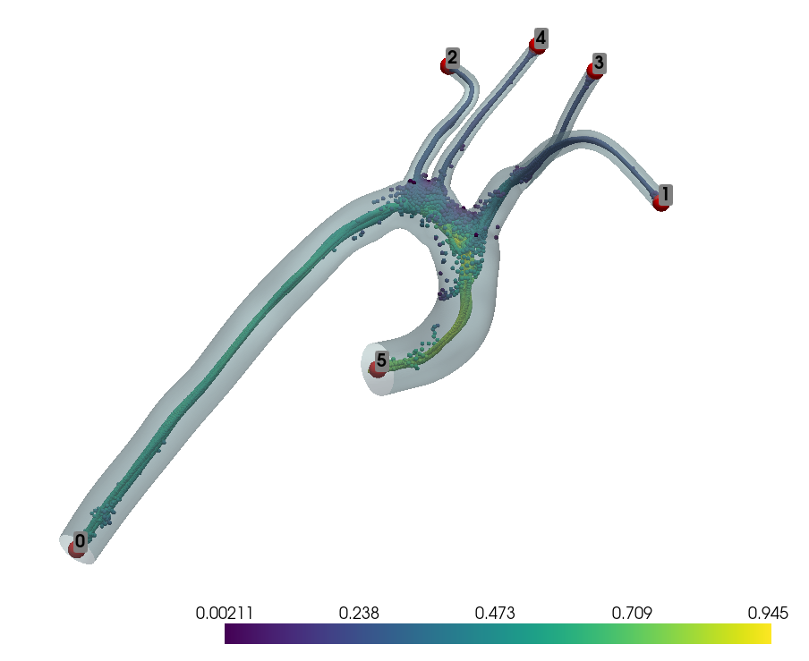
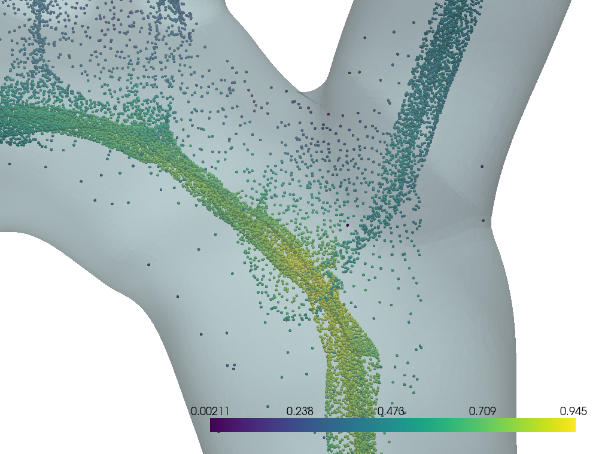
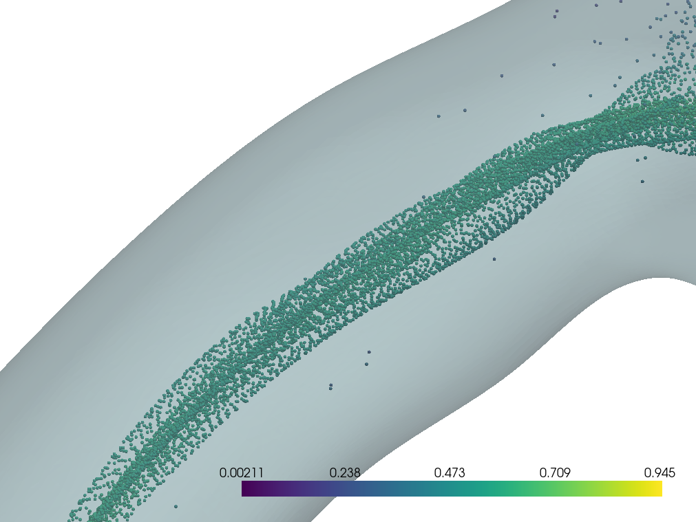
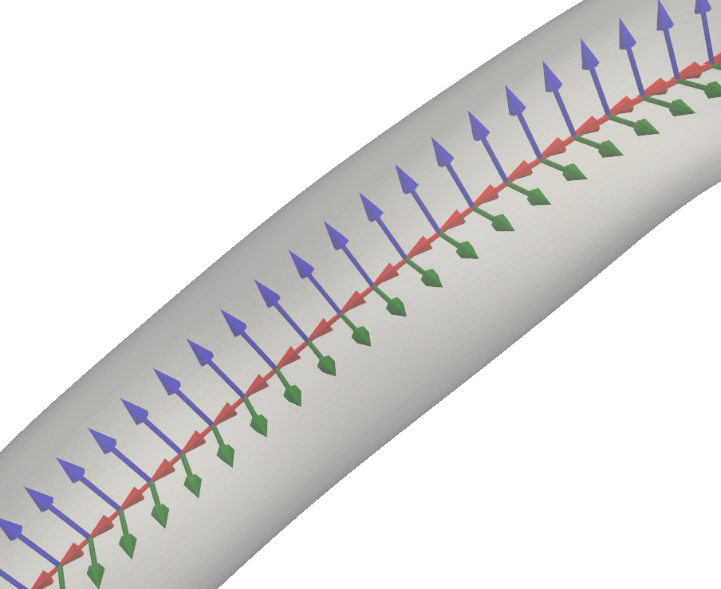
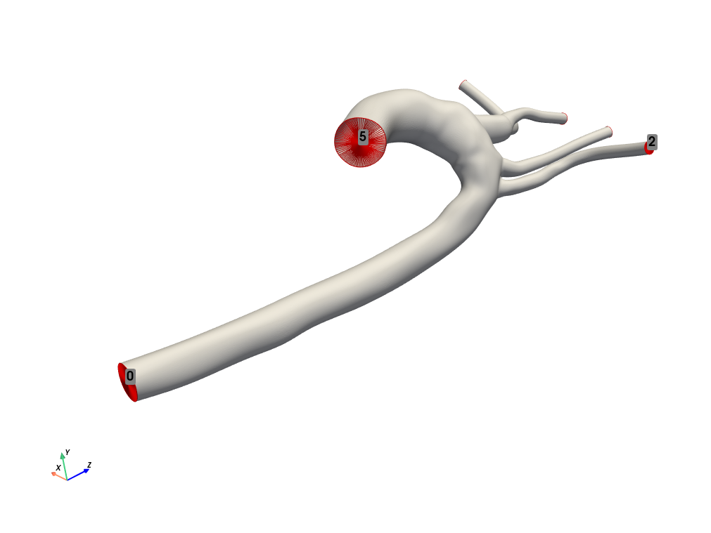
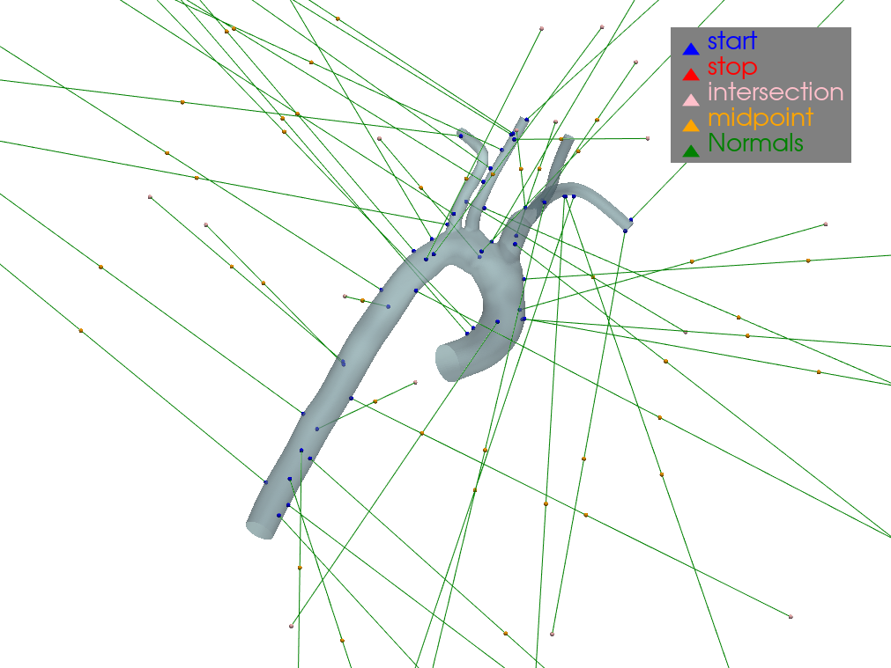
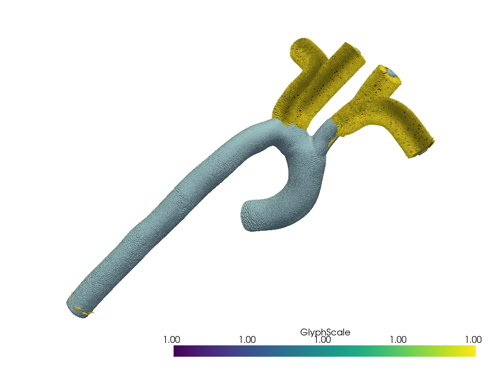

# tutorial - vascular_encoding_framework

## Introduction

The Python implementation of the Vascular Encoding Framework to analyze and compare vascular structures.

## Table of Contents

- [Requirements](#requirements)
- [Installation](#installation)
- [Usage](#usage)
  - [Library Import](#library-import)
  - [Case Study Configuration](#case-study-configuration)
  - [Mesh Loading and Preparation](#mesh-loading-and-preparation)
  - [VascularMesh Initialization](#vascularmesh-initialization)
  - [Boundary Hierarchy Visualization and Definition](#boundary-hierarchy-visualization-and-definition)
  - [Centerline Domain Extraction](#centerline-domain-extraction)
  - [Centerline Path Tree Calculation](#centerline-path-tree-calculation)
  - [Node Definition for Each Branch](#node-definition-for-each-branch)
  - [Centerline Network Creation](#centerline-network-creation)
  - [Adapted Frame Visualization](#adapted-frame-visualization)
  - [Vessel Coordinates Calculation](#vessel-coordinates-calculation)
  - [Results Visualization](#results-visualization)
- [Outputs](#outputs)
- [Figures](#figures)
   - [Main Figures](#main-figures)
   - [Secondary Figures](#secondary-figures)
- [Troubleshooting](#troubleshooting)
- [Contributions](#contributions)
- [License](#license)

## Requirements

- Python 3.x
- Conda (recommended for environment management)

## Installation

1. Clone the repository:

```bash
git clone https://github.com/PauR0/vascular_encoding_framework.git
```

2. Create a virtual environment and install the dependencies:

```bash
conda create -n vef_env python=3.8
conda activate vef_env
```

## Usage

### Library Import

```python
import os
import numpy as np
import pyvista as pv
import vascular_encoding_framework as vef
from vascular_encoding_framework.jose.casepath import CasePath
```

These lines import the necessary libraries for the tutorial, including the Vascular Encoding Framework (VEF). These dependencies are downloaded when creating the virtual environment using requirements.txt.

### Case Study Configuration

```python
case_path_obj = CasePath()
case_path = case_path_obj.get_case_path()
mesh_path = os.path.join(case_path, 'Meshes', '0093_0001.vtp')
```

This defines the path to the case study downloaded from the Vascular Model Repository.

### Mesh Loading and Preparation

```python
mesh = pv.read(mesh_path)
mesh = mesh.threshold(value=0.1, scalars='CapID', method='lower').extract_surface()
mesh = mesh.smooth(n_iter=100)
mesh = mesh.subdivide(1)  # Increase the subdivision level if necessary
```

The mesh is loaded and opened by removing the caps to obtain an open mesh.

### VascularMesh Initialization

```python
vmesh = vef.VascularMesh(mesh)
```

The VascularMesh class is initialized with the open mesh.

### Boundary Hierarchy Visualization and Definition

```python
vmesh.plot_boundary_ids()
```

This command visually displays the IDs assigned to each boundary of the vascular mesh. This is useful for understanding how the different segments or regions of the vascular structure are numbered or labeled.

```python 
hierarchy = {
    "5" : {"id" : "5", "parent" : None, "children" : {"0"},},
    "0" : {"id" : "0", "parent" : "5",  "children" : {"3", "4", "1"}},
    "3" : {"id" : "3", "parent" : "0",  "children" : {"2"}},
    "4" : {"id" : "4", "parent" : "0",  "children" : {}},
    "1" : {"id" : "1", "parent" : "0",  "children" : {}},
    "2" : {"id" : "2", "parent" : "3",  "children" : {}},
}
```

This dictionary structure defines the boundary hierarchy. Each entry represents a boundary and specifies:

- Its ID.
- Its parent in the hierarchy.
- Its children in the hierarchy.

This hierarchy is crucial for understanding the topological structure of the blood vessel, relating the inlets and outlets of blood flow.

- Boundary `5` is the root of the hierarchy (has no parent).
- Boundary `0` is a child of `5` and a parent of `3`, `4`, and `1`.
- Boundaries `1`, `2`, `4` are leaves (have no children).

```python
vmesh.set_boundary_data(hierarchy)
```

This command applies the defined hierarchy to the vascular mesh.

### Centerline Domain Extraction

```python
c_domain = vef.centerline.extract_centerline_domain(vmesh=vmesh,
                                                    method='seekers',
                                                    method_params={'reduction_rate':0.75, 
                                                    'eps': 1e-3},
                                                    debug=False)   
```

This code uses the `centerline.extract_centerline_domain` function from VEF to obtain an approximation of the vessel lumen domain. By running this command, we will get a point cloud that will later be used as the domain to find the optimal path between them. The centerline is a simplified representation of the central axis of blood vessels.

#### Parameters used:

- **vmesh**: The previously initialized vascular mesh.

- **method = 'seekers'**: The method to be used will be the *seekers* algorithm, used to search and extract the centerline domain.

- **method_params**: Specific parameters to adjust the *seekers* method:
  - **reduction_rate=0.75**: This suggests that the algorithm reduces the domain complexity by 75% to optimize the calculation. It controls the reduction rate of the original mesh, affecting how many points are retained to compute the centerline.
  
  - **eps = 1e-3**: Value used as a tolerance threshold for the chosen algorithm.

- **debug = False**: 
  - When set to False, process visualizations are not displayed.
  - When set to True, it provides a series of graphs, which will be seen in the [Secondary Figures](#secondary-figures) section.

#### Seekers Algorithm:

- The Seekers class uses a seeker-based approach to extract the centerline domain.
- Initially, a simplified version of the original mesh is created through decimation and smoothing (method `compute_seekers_initial_positions`). We do not apply this because we are not interested in decimating the mesh due to its low intrinsic resolution, but we can redefine it using the `reduction_rate` parameter.

- Then, for each seeker point:
  1. The internal normal of the surface is calculated.
  2. A ray is traced from the point in the direction of the internal normal.
  3. The intersection point of this ray with the opposite vessel wall is found.
  4. The midpoint between the initial point and the intersection point is considered part of the centerline domain.

This process is repeated for multiple points on the surface, creating the point cloud.

Once the point cloud along the entire interior of the blood vessel is obtained, we proceed with the path tree calculation, which will represent the centerline.

### Centerline Path Tree Calculation

```python
cp_xtractor = vef.centerline.CenterlinePathExtractor()
cp_xtractor.debug = True
cp_xtractor.set_centerline_domain(c_domain)
cp_xtractor.set_vascular_mesh(vmesh, update_boundaries=True)
cp_xtractor.compute_paths() 
```

This code calculates the centerline path tree according to the defined hierarchy.

1. **Initialization of the path extractor:**
   ```python
   cp_xtractor = vef.centerline.CenterlinePathExtractor()
   ```
   Creates an instance of the `CenterlinePathExtractor` class, designed to extract and compute the centerline paths in a vascular mesh.

2. **Activation of debug mode:**
   ```python
   cp_xtractor.debug = True
   ```
   Activates the debug mode of the extractor. When enabled, a 3D visualization of the vascular mesh, the centerline domain, and the boundary labels is generated. This is useful for visually verifying the correct problem setup before centerline extraction.

3. **Setting the centerline domain:**
   ```python
   cp_xtractor.set_centerline_domain(c_domain)
   ```
   Sets the previously extracted centerline domain (`c_domain`) as the basis for path calculation. As mentioned earlier, this domain represents an approximation of the lumen.

4. **Setting the vascular mesh:**
   ```python
   cp_xtractor.set_vascular_mesh(vmesh, update_boundaries=True)
   ```
   - For each centerline point, the distance to the nearest point on the vessel wall is calculated using a K-Dimensional Tree.
   - These distances form the radius field, representing the vessel thickness at each centerline point, allowing a very accurate approximation of the original vessel geometry. According to Figure 4 of the article, the B-Spline approximation using the radius field closely reproduces the input data, with generally low residuals (around 1 mm in the most complex areas).

   - Using this new mesh geometry, it updates the original mesh boundaries with `update_boundaries=True`, so we work from now on with the new geometry.

   **Advantages of this representation:** 
    - The geometry is encoded with a reduced number of real values, resulting in a low-dimensional, fixed representation, thus reducing computational complexity.
    
   - The resulting approximation is a differentiable surface, which is useful for subsequent

 calculations.

    - Using a common coordinate system (VCS) allows establishing point-to-point correspondences between different anatomies.

    - It enables generating specific meshes (such as cylindrical grids) needed for accurate fluid simulations.
    
    - Facilitates shape variability analysis and the creation of statistical shape models.

5. **Path calculation:**
   ```python
   cp_xtractor.compute_paths()
   ```
   - This method calculates the paths from each outlet to the inlet of the blood vessel, using the previously defined boundary hierarchy.

   - It uses a modified version of the A* algorithm, which in this case behaves like Dijkstra's algorithm since the heuristic is set to 0. This means the algorithm seeks the lowest-cost path between points.
    
   The centerline is defined as:
   > "In our work, we construct the centerline as the curve **c** that connects the two planes A and B and maximizes the minimum distance from the vessel wall to each point on **c**."

The result is a pyvista MultiBlock structure with the computed paths, representing the blood vessel's centerline.

### Node Definition for Each Branch

```python
knot_params = {
    "5" : {"cl_knots" : None, "tau_knots" : None, "theta_knots" : None},
    "0" : {"cl_knots" : 15,   "tau_knots" : 19,   "theta_knots" : 19},
    "3" : {"cl_knots" : 15,   "tau_knots" : 10,   "theta_knots" : 10},
    "4" : {"cl_knots" : 15,   "tau_knots" : 10,   "theta_knots" : 10},
    "1" : {"cl_knots" : 15,   "tau_knots" : 10,   "theta_knots" : 10},
    "2" : {"cl_knots" : 15,   "tau_knots" : 10,   "theta_knots" : 10},
}  
```

Degrees of freedom are defined for the fitting procedure of each branch.

1. **knot_params Structure**

   Each entry in knot_params corresponds to a blood vessel branch, identified by a number. For each branch, three types of knots are defined:
   
   * `cl_knots`
     Knots for the centerline
   * `tau_knots`
     Knots for the longitudinal coordinate $\tau$
   * `theta_knots`
     Knots for the longitudinal coordinate $\theta$

   These knots are fundamental for the vessel representation using B-Splines:
   
   * **Centerline (cl_knots)**
     * Used to approximate the curve $c(\tau)$ that defines the vessel's longitudinal direction.
     * Equation 6 of the article shows how the centerline is represented:
       $$
       c(\tau) = \sum_{i=0}^{n} c_i B_{t,i}(\tau) \notag
       $$
       where $\mathbf{c}_{i}$ are three-dimensional coefficients and $B_{\mathbf{t}, i}$ is a B-Spline basis.
     * The cl_knots determine how many coefficients $c_i$ will be used in this approximation.
   
   * **Wall coordinates (tau_knots and theta_knots)**
     * Used to approximate the function $\rho_w(\tau,\theta)$ that describes the wall-to-axis distance.
     * Equation 7 of the article shows this bivariate approximation:
       $$
       \rho_w(\tau,\theta) = \sum_{i=0}^{n1} \sum_{j=0}^{n2} b_{ij} B_{ij}(\tau,\theta) \notag
       $$
       where $B_{i, j}(x, y)=B_{i}(x) \cdot B_{j}(y)$ and $(\tau, \theta) \in[0,1] \times[0,2 \pi]$.
     * The tau_knots and theta_knots determine how many coefficients $b_{ij}$ will be used in this approximation.

**Importance of knots:**

* They control the flexibility and accuracy of the vessel representation.
* The knot parameters define the degrees of freedom for spline fitting. According to the article, the approximation quality depends on the number of knots used. More knots allow a more detailed representation but increase computational complexity.

**Variation between branches:**

* Branch "5" has all values as None because it is the root.
* Branch "0" has more knots (19 for tau and theta), suggesting it might be a more complex or important segment (probably because it is longer than the rest).
* The other branches have fewer knots (10 for tau and theta), indicating simpler or less critical segments.

**Relationship with VCS**

* These knots allow creating a parametric representation of the vessel that is fundamental for the VCS.

It is then represented by the equation:

$$
\mathbf{x}(\tau, \theta)=\sum_{i=0}^{n} \mathbf{c}_{i} B_{i}(\tau)+\left[\sum_{i=0}^{n_{1}} \sum_{j=0}^{n_{2}} b_{i j} B_{i j}(\tau, \theta)\right]\left(\mathbf{v}_{1} \cos (\theta)+\mathbf{v}_{2} \sin (\theta)\right) \notag
$$

* They allow precise and efficient conversion between Cartesian coordinates and vessel coordinates ($\tau$, $\theta$, $\rho$).

### Centerline Network Creation

```python
cl_net = vef.CenterlineNetwork.from_multiblock_paths(cp_xtractor.paths, 
knots={k:v['cl_knots'] for k, v in knot_params.items()})    
```

The centerline network is created from the extracted paths.

1. ```python
   cp_xtractor.paths
   ```
   Contains the discrete paths extracted that maximize the distance to the vessel walls, as obtained earlier.

2. **Knots Definition**

   ```python
   knots={k:v['cl_knots'] for k, v in knot_params.items()}
   ```
   This is a dictionary comprehension that creates a new dictionary. For each key-value pair in knot_params, it takes the key k and the value corresponding to 'cl_knots' of v. This defines the number of knots to be used for each centerline segment in the spline fitting.

3. **Conversion to differentiable curves:**

   ```python
   vef.CenterlineNetwork.from_multiblock_paths()
   ```

   * Iterates over each path in the MultiBlock.
   * For each path, creates a Centerline object using the path points and the specified knot parameters.
   * Fits a cubic spline to the path points, using the specified number of knots to control the fitting complexity.
   * Sets the parent-child relationships between centerline segments based on the 'parent' information in the field data. This is crucial for representing the branched structure of blood vessels, where a main vessel can split into smaller vessels.
   * Handles the junctions between segments. At junctions between segments, performing a grafting if necessary to smooth the transitions.

4. **Result:**

   The result cl_net is an instance of CenterlineNetwork representing the hierarchical structure of the blood vessel centerlines, with each segment represented as a cubic spline and the topological relationships between segments preserved.

It creates a hierarchical structure of cubic spline curves representing the blood vessel's centerlines, using the extracted discrete paths and the specified knot parameters for each branch. This provides a continuous and differentiable mathematical basis for the VCS.

### Adapted Frame Visualization

```python
plot_adapted_frame(cl_net, vmesh, scale=.5)
```

The adapted frame is visualized to verify that the centerline has been correctly calculated.

This line visualizes the centerline network from the extracted paths using the specified knot parameters for each blood vessel branch.

The adapted frame visualization allows verifying that:

* The tangent vector t is perpendicular to the centerline at each point.
* The vectors $v_1$ and $v_2$ maintain a consistent orientation along the curve, without abrupt rotations.
* The frame adapts smoothly to the vessel's curvature.

The article emphasizes the need for a stable reference frame to define the angular coordinates $\theta$. The visualization allows confirming that the adapted frame obtained by parallel transport is more stable than other methods, such as the Frenet frame.

This visualization provides a visual validation of the VCS, allowing verification that the local reference frame behaves as theoretically described in the article, adapting to the vessel geometry while maintaining the stability needed to define a consistent coordinate system.

### Vessel Coordinates Calculation

```python
bid = [cl_net.get_centerline_association(p=vmesh.points[i], n=vmesh.get_array(name='Normals', 
preference='point')[i], method='scalars', thrs=60) for i in range(vmesh.n_points)]
vcs = np.array([cl_net.cartesian_to_vcs(p=vmesh.points[i], 
cl_id=bid[i]) for i in range(vmesh.n_points)])
vmesh['cl_association'] = bid
vmesh['tau'] = vcs[:,0]
vmesh['theta'] = vcs[:,1]
vmesh['rho'] = vcs[:,2]   
```

The vessel coordinates (VCS) are calculated for each mesh point.

1. **Association of points to the centerline:**

   ```python
   bid = [cl_net.get_centerline_association(p=vmesh.points[i], 
          n=vmesh.get_array(name='Normals', preference='point')[i], 
          method='scalars', thrs=60) for i in range(vmesh.n_points)]
   ```

   This line associates each point of the vascular mesh to a specific branch of the centerline. It uses the point's position (p) and its normal (n) to determine the most appropriate association.

2. **Conversion of Cartesian coordinates to VCS:**

   ```python
   vcs = np.array([cl_net.cartesian_to_vcs(p=vmesh.points[i], 
                   cl_id=bid[i]) for i in range(vmesh.n_points)])
   ```

   Here, the Cartesian coordinates of each mesh point are converted to cylindrical coordinates of the VCS.

3. **Assignment of VCS coordinates to the mesh:**

   ```python
   vmesh['cl_association'] = bid
   vmesh['tau'] = vcs[:,0]
   vmesh['theta'] = vcs[:,1]
   vmesh['rho'] = vcs[:,2]
   ```

   The calculated VCS coordinates ($\tau, \theta, \rho$) are assigned to the vascular mesh.

### Results Visualization

```python
vmesh.plot(scalars='cl_association')
vmesh.plot(scalars='tau')
vmesh.plot(scalars='theta')
vmesh.plot(scalars='rho')    
```

The results of the centerline association and the calculated vessel coordinates are visualized.

1. **Visualization of centerline association:**

   ```python
   vmesh.plot(scalars='cl_association')
   ```

   This line visualizes the association of each mesh point with a specific branch of the centerline. It allows verifying that the assignment of points to the different vessel branches is correct.

2. **Visualization of the longitudinal coordinate $\tau$:**

   ```python
   vmesh.plot(scalars='tau')
   ```

   The distribution of the $\tau$ coordinate along the vessel is shown. According to the article, $\tau \in [0,1]$ represents the normalized longitudinal position in the vessel segment.

3. **Visualization of the angular coordinate $\theta$:**

   ```python
   vmesh.plot(scalars='theta')
   ```

   This visualization shows the distribution of the $\theta$ coordinate. $\theta \in [0, 2\pi]$ represents the angular position in the plane perpendicular to the centerline.

4. **Visualization of the radial coordinate $\rho$:**

   ```python
   vmesh.plot(scalars='rho')
   ```

   The distribution of the $\rho$ coordinate is visualized. $\rho \in \mathbb{R^+}$ represents the distance from the centerline to the point in question.

## Outputs

**Step 1: Run the Script**
When running the modified tutorial, a series of outputs will be generated, providing relevant information to understand how the code is executing.

**Step 2: Enter the Model Path**
First, the script will prompt for the path of the file recently downloaded from the Vascular Model Repository.

```bash
(clean_vascular_env_jose) jose-marin@jose-marin-ASUS-TUF-Gaming-F17-FX707VV-FX707VV:
~/Escritorio/vascular_encoding_framework$ 
/home/jose-marin/miniconda3/envs/clean_vascular_env_jose/bin/python 
/home/jose-marin/Escritorio/vascular_encoding_framework/tutorials/tutorial_final.py
Enter the path to the case directory (e.g., /home/user/cases/0007_H_AO_H):    
```

Enter the folder containing the .vtp model. In this case:

```bash
/home/jose-marin/Escritorio/vascular_encoding_framework/tutorials/0010_H_AO_H/Meshes
```

**Step 3: Add a New Model (Optional)**
If you want to add another model, delete the `CasePath.txt` file from the directory where it was created. In this case, the directory:

```bash
/home/jose-marin/Escritorio/vascular_encoding_framework/tutorials/0010_H_AO_H
```

And modify `0093_0001.vtp` in the tutorial to the .vtp file within the case directory. So,

```python
mesh_path = os.path.join(case_path, 'Meshes', 'new_mesh_name.vtp')
```

From here, it will provide the initial hierarchy for the branches as output:

```bash
Initial boundaries:
Boundary 0 connected to: {'4', '1', '3'}
Boundary 1 connected to: set()
Boundary 2 connected to: set()
Boundary 3 connected to: {'2'}
Boundary 4 connected to: set()
Boundary 5 connected to: {'0'}
```

And it will proceed to extract the centerline domain with the adjusted parameters, providing multiple graphs, depending on whether `debug = False` or `debug = True`. Then, a final graph will show the point cloud generated by the *seekers* method.

Next, the optimal path between the points will be computed, providing additional information about the number of points it takes to go from one boundary to another of the vascular structure, among others:

```bash
Attempting to compute path from boundary 5 to 0
No valid path found from boundary 5 to 0
Attempting to compute path from boundary 0 to 4
Path found: 106 points
Attempting to compute path from boundary 0 to 1
Path found: 106 points
Attempting to compute path from boundary 0 to 3
Path found: 106 points
Attempting to compute path from boundary 3 to 2
Path found: 74 points
Number of centerline domain points: 73277
Centerline domain bounding box: (-5.316318511962891, 4.683925628662109, -3.2394332885742188, 
1.9721324443817139, -2.424973964691162, 17.93456268310547)
```

Finally, it will provide a graph showing the construction of the VCS.

## Figures

### Main Figures

#### Figure 1

*Figure 1: Detailed plot generated by activating debug with `cp_xtractor.debug = True`.*

- The gradient represents the magnitude of the blood vessel radius along the centerline. 
- The red points numbered 0 to 5 represent the boundaries or borders of the vascular structure. 
- The inner vessel points are generated using the centerline extraction algorithm, utilizing the *seekers* method.

#### Figure 2

*Figure 2: Detailed view of the point cloud obtained using *seekers*, showing how the midpoint positions in the branch intersections are more erratic due to the geometry between the starting wall and the opposite wall. This condition does not affect path finding as there are many other points that the algorithm considers a priority, thanks to the point density around the centerline.*

#### Figure 3

*Figure 3: Detailed view of the point cloud obtained using *seekers*, showing that the midpoint positions in the central parts of the branches are more stable due to the geometry between the starting wall and the opposite wall, facilitating subsequent path finding in these areas.*

#### Figure 4

*Figure 4: VCS plot generated using the commands from section 4.*

#### Figure 5

*Figure 5: Detailed view of the VCS, clearly demonstrating the stability of the coordinate system.*

### Secondary Figures

This section will present figures that generally appear when modifying the Debug command from False to True, or when requesting an intermediate step to be plotted. These are useful in situations where the script is failing or to see how certain aspects of the code develop.

#### Figure 6 

*Figure 6: Visualization of the boundaries or borders of the vascular structure, numbered from 0 to 5. Obtained using the `vmesh.plot_boundary_ids()` command.*

#### Figure 7

*Figure 7: Visualization used to identify key points within the vascular structure that will serve as the basis for more refined later analyses.*

The green lines are the surface normals. The Seekers algorithm uses these internal normals to approximate the centerline position.

The colored triangles represent:
- **Blue (start)**: Start points of the vascular segments.
- **Red (stop)**: End points of the vascular segments.
- **Pink (intersection)**: Intersection points between different segments.
- **Orange (midpoint)**: Midpoints of the vascular segments.

#### Figure 8

*Figure 8: Visualization of normalized internal surface normals.*

The internal surface normals start from the surface inward. These are normalized. In the ascending and descending aorta sections, the vectors do not intersect with the opposite wall, as the vessel radius in that area is greater than 1, so the arrows are not visible. However, in the superior arteries section, with a radius less than 1, the vectors intersect with the opposite wall.

The GlyphScale indicates the length of the normal vectors, which is 1. If we zoom in to see the interior of the descending and ascending aorta, we would see that those vectors are indeed yellow, meaning they have a length of 1.

#### Figure 9

*Figure 9: Triptych visualization of the 3D mesh, normalized internal surface normals, and points obtained by the *seekers* method.*

## Troubleshooting

1. **Dependency Compatibility:**
    - Install all dependencies using `conda` to avoid compatibility issues between packages.

2. **Execution Errors:**
    - Adjust the `reduction_rate` and `eps` parameters as needed to avoid errors in the centerline domain extraction.

## Contributions

Contributions are welcome. Please open an issue or send a pull request.

## License

This project is licensed under the MIT License.

```

This README.md is designed to be clear and concise, providing all the necessary information for a user to run and understand the modified tutorial of the Vascular Encoding Framework.